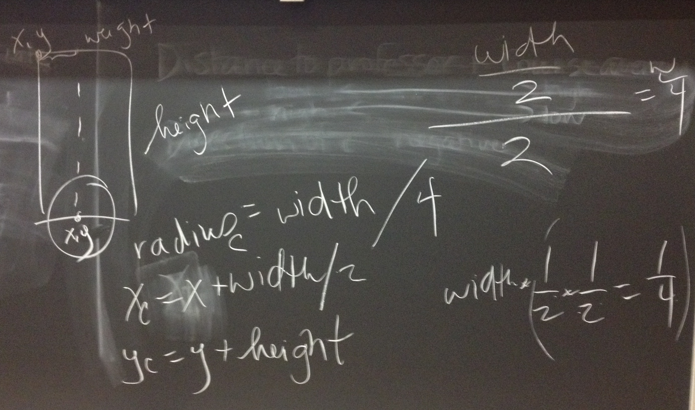

# Board Notes & Demo Code

## 2/23

### Drawing BoxCar

Wheel in BoxCarPart object code should be relative to box car rectangle: 
 

How to draw wheel relative to box car part: 
 

Drawing 3 BoxCarPart objects relative to overall BoxCar: 
 

### Initial BoxCar & BoxCarPart Code

BoxCarPart: 
 

BoxCar: 
 

 * My project code: [BoxCar_2_23.zip](BoxCar_2_23.zip)

