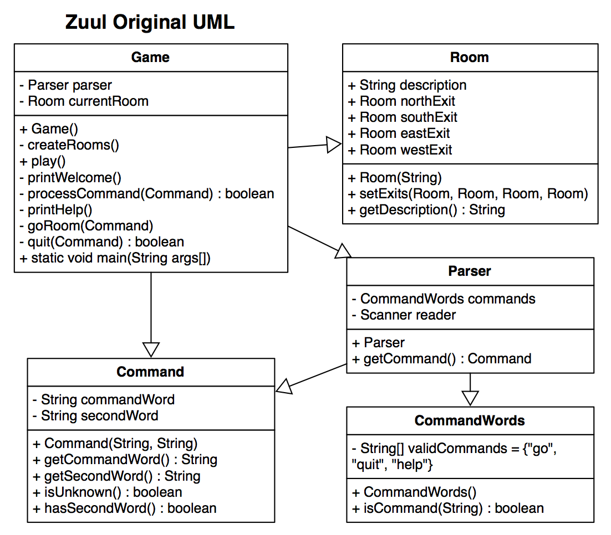
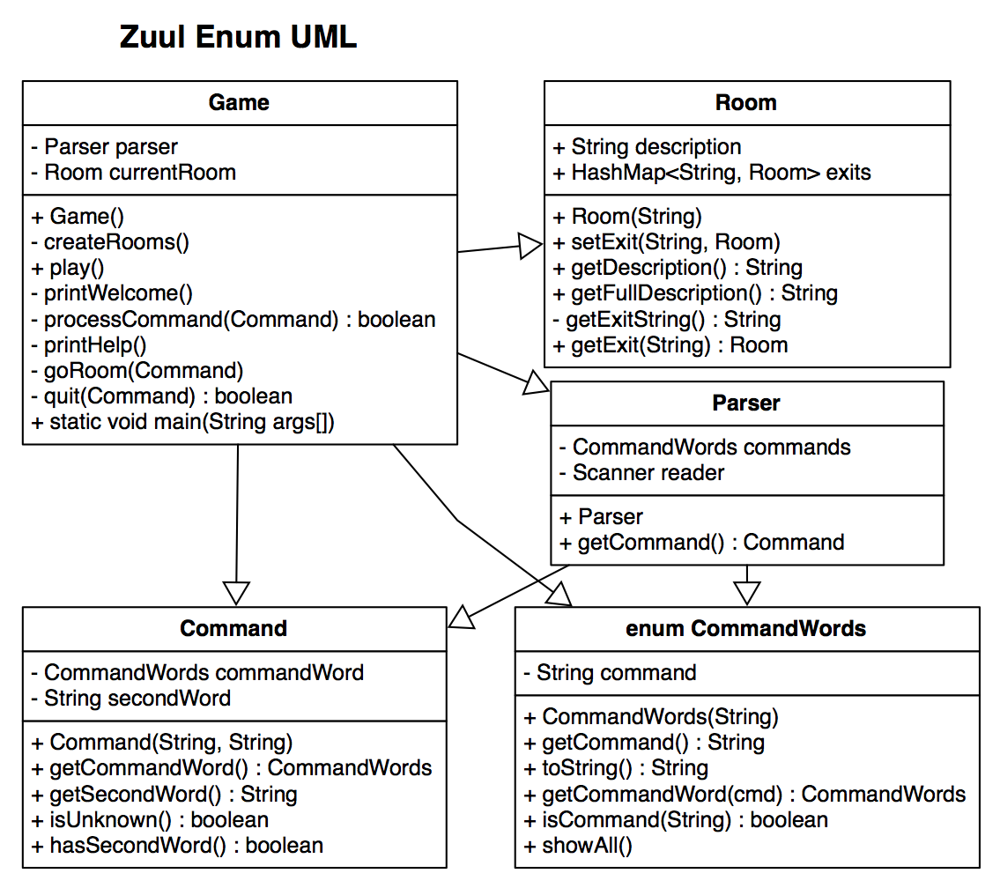

# PWOD8: World of Zuul

In this WOD we will see how to refactor an existing Java project so that code changes are easier to make. We began this PWOD in class.

<!---->

## Instructions

1. If you haven't been following along in class, download the [Zuul Starter Project](Zuul-orig.zip) and import it into your workspace.
2. Implement the suggested changes in [Tasks.docx](Tasks.docx). Specifically, you will be moving from the original code design:

***to:***

For the final task (adding support for additional command languages besides English), it is recommended you create a [CommandWords class](CommandWords-JavaDoc.docx).

## Demonstration

*Coming soon...*

<!--Once you've finished doing the WOD a single time, watch me do it:



### My Final Project

[Picture_forest.zip](Picture_forest.zip)

-->
